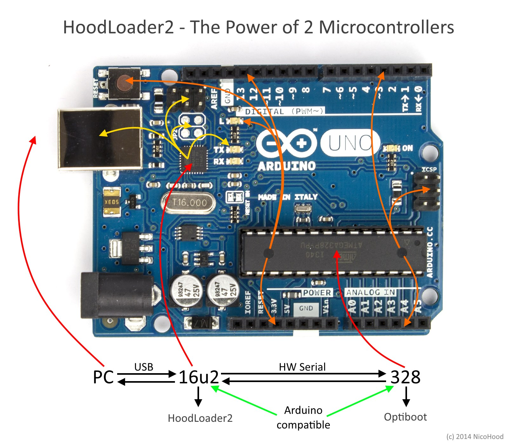
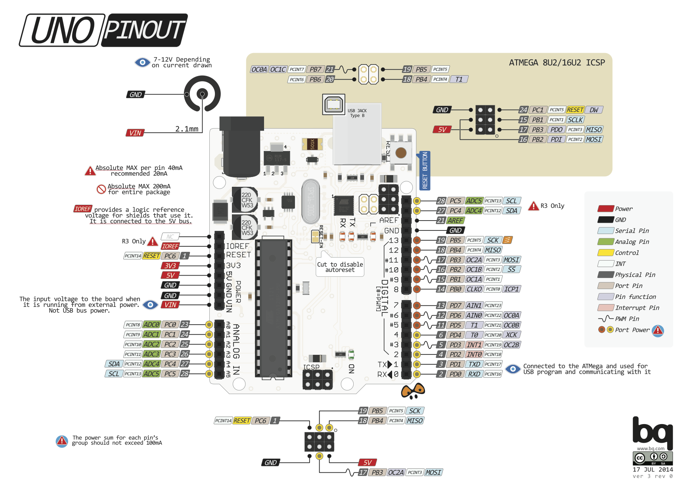
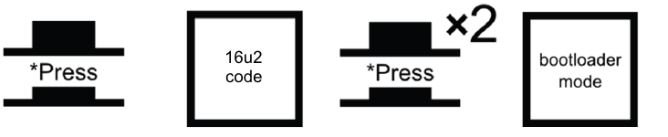

Hoodloader v2 Alpha
=============



**Hoodloader v2 takes Arduino Uno's and Mega's USB functions to a whole new level.**
Version 2 is a __real__ bootloader  for the 16u2 (not a firmware like v1) which replaces the DFU Bootloader
with a custom CDC Bootloader with USB-Serial function. You can reprogram the main MCU (328/2560) and the USB MCU (16u2)
at the same time with all its functions and no limitations.

It adds **fully Arduino IDE compatibility** (with some i/o pins) for the 16u2 to use it as standalone AVR for custom sketches too.
Whether __USB__ function (e.g. HID: Keyboard, Mouse, Gamepad, Media Keys), sensors or leds: anything you can imagine of.
**All you need is a normal Arduino Uno/Mega R3 + USB cable + a few wires.**

You should read the readme carefully to understand what the Hoodloader v2 is used for and what it can make possible.
Also it is very important to follow the installation instructions and its warnings carefully.
At the end is a written text about the idea, the key functions and how I got there.
There is also a small Hoodpedia with some words you might not understand and its explanation
to let everybody understand what USB is all about (mostly :D).

See [HID Project](https://github.com/NicoHood/HID) for the Arduino IDE core files/examples.

See http://nicohood.wordpress.com/ for more tutorials, projects and contact.

HID Project
===========

This project went to a lot of phases and we now reached a library with 3 software solutions.
The idea is to enable enhanced USB functions to almost all 'standard' Arduino boards (Uno, Mega, Leonardo, Micro).
To make things more clear the HID Software is in this repository and the Hoodloader (v1 & v2) sources are in their own repositories.

**The HID project contains 3 software solutions:**
* Arduino Leonardo/(Pro)Micro extended USB HID-report descriptors
* [Hoodloader v1](https://github.com/NicoHood/Hoodloader) 328/2560 HID Serial Protocol functions (Uno/Mega)
* [Hoodloader v2](https://github.com/NicoHood/Hoodloader2) 16u2 USB cores with HID (Uno/Mega)

The API (syntax) is always the same for each project, so you can port code from one divice to another very easy.

Overview: Features/Limitations
==============================

**Normally any R3 Uno/Mega has a 16u2.** Earlier versions had an 8u2
and some online shops even sell the bigger 32u2 (I've got two of them *g*).

**Hoodloader v2 functions:**
* CDC Bootloader for the 16u2 (to upload .hex files via avr-dude/Arduino IDE)
* USB-Serial programming of the 328/2560

**[HID Project](https://github.com/NicoHood/HID) features (for Hoodloader v2):**
* Arduino IDE integration + programming with the 16u2
* Self flashing sketch to burn the Hoodloader v2 to the 16u2 (modified version from Nick Gammon)
* IDE example USB-Serial demo (equal to original firmware)
* IDE example sketches for 16u2 HID devices (Mouse, Keyboard, Gamepad, Media/System Keys)
* IDE example sketch for 16u2 - 328/2560 communication (Hoodloader v1 technique)

**16u2 key parameters on a normal Uno/Mega R3:**
* 16kb flash (minus 4kb for the Hoodloader v2) (8 for a 8u2, 32 for a 32u2)
* 500 bytes ram 8u2 and 16u2 (1000 bytes ram for a 32u2)
* 4 usable USB Endpoints (CDC Serial: 3, each HID device: 1 (multi report possible))
* 176 bytes DPRAM (ram for USB endpoints, double bank possible)
* 2 status LEDs (PD4 RX + PD5 TX)
* 7 i/o pins with PCINT, SPI and PWM (3 pin SPI header + additional 4 pin header)
* HW Serial connected to Serial0 of the 328/2560
* PD7 connected to RESET of the 328/2560
* Not all pins are broken out (SS, INT, etc)
* No I2C (u2 series doesn't have TWI) but Serial (to 328/2560) and SPI (master only)
* No USB-Serial bridge at baud 1200 possible, used for CDC self reprogramming

| 8/16/32u2 Flash | Bootloader (4kb)                            | Program (4/12/28kb)    |
|:----------------|:--------------------------------------------|:-----------------------|
| Before          | DFU Bootloader (via Flip)                   | USB-Serial Firmware    |
| After           | Hoodloader v2 (CDC Bootloader + USB-Serial) | Custom Sketch/Firmware |


Hoodloader v2 is a __Bootloader__ not a firmware. It replaces the DFU bootloader with a CDC bootloader.
**You wont be able to flash any hex file with [Flip](http://www.atmel.com/tools/flip.aspx) any more.**
But this gives us the option to use avr-dude to flash the 16u2 with custom firmware.

The main advantage is to **flash the 16u2 with the Arduino IDE**.
Hoodloader v2 comes with full Arduino compatible core (see [HID Project](https://github.com/NicoHood/HID))
to create your very own custom programs with the normally unused 16u2 USB chip.
You can either use the CDC + HID, more than one HID interface without CDC or custom USB devices (similar to Teensy).

**To sum up: You can flash the 16u2 with avr-dude or Arduino IDE and the 328/2560 with the Arduino IDE like you are used to.**

See [HID Project](https://github.com/NicoHood/HID) for the Arduino IDE core files/examples.

Arduino Uno Overview/Pinout
===========================


(c) [pighixxx](http://forum.arduino.cc/index.php/topic,146315.0.html)


16u2 Pinout
```
TODO
```
**Note: Some pins are not connected on a standard Arduino Uno R3** but still listed so you can use them if you had a custom board.
You also need to solder the additional 4 pin header to access all 7 PB i/o pins.

Hoodloader v2 - Installation
============================

**Caution: You will overwrite the DFU Bootloader. Read the installing instructions carefully, double check connections and __dont panic__!**

**You wont be able to flash any hex file with [Flip](http://www.atmel.com/tools/flip.aspx)
via DFU any more** (but via avr-dude instead).

**If anything goes wrong while burning the bootloader you can 'brick' your Arduino.**
Bricking is a wide defined term. In this case bricking 'only' means that you cannot use your Arduino's 16u2 USB-Serial bridge
any more without a second ISP or an [Arduino that acts as ISP](http://arduino.cc/en/Tutorial/ArduinoISP) /
[16u2 as ISP with Hoodloader v1](https://github.com/NicoHood/Hoodloader#16u2-as-isp-usage)).
But there are still ways to upload the firmware to your 16u2 with a 'bricked' 16u2 Bootloader/USB-Serial firmware
as long as the installation sketch is on your 328/2560 __or__ you have a second Arduino as ISP/ISP, see below.

To install a bootloader in general we would need an ISP (In system programmer).
You still can use your own ISP if you like to. For those of you who only have a standalone Arduino Uno/Mega R3
we use a modified version of Nick Gammon's [Atmega Board Programmmer](https://github.com/nickgammon/arduino_sketches).
In this case the 328/2560 acts as ISP with a the Hoodloader .hex preloaded in PROGMEM.
If you just want to use your own ISP to burn the hex file, see below.

Installation sketch
-------------------

First remove __all__ hardware from your Arduino to ensure nothing is messing up the upload.
All we need to do is to connect the SPI lines correct together like this:

TODO picture
============

```
Pin connections:
16u2  - 328/2560
MOSI  - MOSI (pin x Uno | pin x Mega)
MISO  - MISO
SCK   - SCK
RESET - PIN 10

328/2560 installation sketch pin functions:
13 status led
 Softserial TX
 Softserial RX
 Manual Hoodloader flash
 Manual DFU bootloader flash

```

Get the Arduino IDE installation sketch from the [HID Project](https://github.com/NicoHood/HID).

Upload the installation sketch to your Arduino Uno/Mega. The sketch can burn bootloaders to several MCUs, made by Nick Gammon.
Its special modified to ensure high security to not brick your Arduino. The normal way is to control the uploading via Serial.
But if anything goes wrong and you can't access the Serial via USB any more you still are able to try different methods to flash the 16u2.
You can access the Serial programming interface also on Softserial on pin x for TX and x for RX. Short pin x to deactivate Serial0 programming.
If you don't have a second USB-Serial adapter the only way to flash the MCU is then to connect a button to pin x to flash the Hoodloader
or to pin x to flash the DFU + USB-Serial manually again.

The led on pin 13 is for status:
* Heartbeat: IDLE, waiting for user input/finished
* Blinking very fast: flashing new firmware
* Blinking every 100ms: error flashing the firmware (See Softserial output)

How to get back to the DFU bootloader


Burning via ISP (advanced)
--------------------------
This is for advanced users who want to burn the bootloader with an external ISP directly.
You can do this with your program if choice (e.g. avr-dude) or use the Arduino IDE and select 16u2 and hit "burn bootloader".

TODO lock fuses to deactivate bootloader section access?
====

```
low_fuses=0xFF
high_fuses=0xD9
extended_fuses=0xF4
unlock_bits=0x3F
lock_bits=0x2F
```

Hoodloader v2 - How to use
==========================



**Short the reset pin once to enter the actual 16u2 program** (see picture below). Then your 16u2 firmware/sketch starts running.
By default the program starts. If no program is presented the bootloader will run.

Because the Hoodloader replaces the 16u2's bootloader you can enter it like the Arduino Leonardo bootloader.
**Short the reset pin twice to enter bootloader mode (manually)** to upload code to the 16u2 or the 328/2560.
Then you have full CDC bootloader functions and USB-Serial with auto reset.

Once you've uploaded your custom program it is possible that you don't have/use the CDC Serial any more.
That might happen if you want to use more USB-HID functions which would be limited by the CDC.
To enter bootloader mode to upload to one of the two MCUs (16u2 and 328/2560) short the reset pin twice again.


How to upload sketches to the 328/2560
--------------------------------------

Short the 16u2's reset pin twice to enter bootloader mode. You can upload your Arduino sketch like you are used to.
You might need to check the correct Serial port though. To start the 16u2 sketch again short reset again once.

How to upload sketches to the 16u2 via IDE
------------------------------------------

You can now use the 16u2 as normal Arduino USB board like a Leonardo/Micro/Teensy.
You have to install new drivers since it will conflict with the official due to new USB functions.
(it will use a different PID/VID)

Go to the [HID Project](https://github.com/NicoHood/HID) page to get the newest Arduino core library for the 16u2.


How to upload/flash firmwares (hex files) to the 16u2 with avr-dude
-------------------------------------------------------------------

If you want to upload a self compiled .hex file from a LUFA project for example like the
[Hoodloader v1](https://github.com/NicoHood/HoodLoader) for example
you wont be able to use DFU via Flip any more. But you can use avr-dude instead:

Install avr-dude with 
or download here

TODO
====
```
#select com port/device and .hex file
avrdude.exe -C avrdude.conf -p at90usb162 -c avr109 -b 1200 -P COM13 -U flash:w:Hoodloader1_8.hex 
avrdude.exe -C avrdude.conf -p at90usb162 -c avr109 -b 1200 -P COM13 -e
```


Two Microcontrollers are better than one
=========================================

**This section describes how the whole thing works together and gives some background information.
For better understanding I recommend to read this.**

As you might know the Arduino Uno/Mega have two AVR Microcontroller.
The Uno has a 328 and the Mega has a 2560. What most people dont know is that
both Arduinos also have a 2nd Microcontroller, the 16u2
(before it was a 8u2 and even earlier it was a simple FTDI USB-Serial bridge).
Some cheap Arduinos might not have a 8u2 or 16u2 because simple FTDI chips might be cheaper
and normally not needed for its normal use.

Here I refer to the 16u2 which is standard for every R3 model of Uno/Mega.
The 16u2 is normally used to program the main MCU 328/2560. Its a USB-Serial Bridge.
But it can be used for many different things because its a standalone AVR
with USB functions like a 32u4 on a Leonardo/Micro board.
For example: [Hiduino](https://github.com/ddiakopoulos/hiduino), 
[Darrens Arduino Uno Keyboard](http://hunt.net.nz/users/darran/weblog/b3029/Arduino_UNO_Keyboard_HID_version_03.html)
[Hoodloader v1](https://github.com/NicoHood/Hoodloader) or any other custom firmware.

So what does this tell us? We can use the 16u2 as a normal microcontroller of course.
The problem was that its not accessible to everybody because its a bit hard to understand
how to flash the 16u2, how to compile a program for the 16u2 (especially with [LUFA](http://www.fourwalledcubicle.com/LUFA.php))
and the biggest problem: How to flash the main MCU (328/2560)? Because if we change the 16u2's firmware
we cannot simply flash the Arduinos main MCU.

The [Hoodloader v1](https://github.com/NicoHood/Hoodloader)
solved this problem for the first time and its still a good and usable firmware to use USB functions
and upload sketches to the main MCU at the same time like you are used to.
But there were a few challenges with that. The biggest problem was just that it is hard to explain
how that complex stuff works. I think it wasn't clear all the time, also because I had two repositories
([HID Project](https://github.com/NicoHood/HID) and [Hoodloader v1](https://github.com/NicoHood/Hoodloader)).

The HID stuff always relied on a Serial communication between 16u2 and 328/2560 which wasn't perfect.
The 16u2 got HID commands with a special [NHP](https://github.com/NicoHood/NicoHoodProtocol) from the main MCU
and filtered every other signal and sent it to the PC Serial (CDC Serial).
Because when the PC USB-HID side was slow it had no chance to wait for the USB keys to flush.
And the main MCU had no chance to get any response back from the 16u2.
Otherwise I had to modify the normal Arduino core libraries very bad to filter out incoming back data
(a 'flushed, next key press' signal) again and it would also blow the sketch size.
Last but not least there were some problems with the multi report descriptor of the [Hoodloader v1](https://github.com/NicoHood/Hoodloader)).
To keep things simple for now: Some OS (linux especially with gamepads) had problems with
too many USB-HID devices in a same report (Keyboard, Mouse, 4 gamepads, Media, etc).

This time I want to keep things more clear but still more flexible.
And I also want to add more documentation for those of you who want to learn this USB stuff
and develop more professional things on their own. I know that its hard to understand the USB protocol.
Its a lot of text in the readme, but hopefully some people are glad about that information.

But I am not perfect neither. I learned everything on my own. Learning by doing.
**I started from scratch at the end of Jan 2014 with Arduino/Electronics!**
So you can do that too, I believe in you :)

Hoodpedia
=========

**Some information that you might find usefull. Ask me for more help**

* CDC-Serial: A virtual Serial port via USB to the PC
* USB-HID: Human Interface Device for Keyboard, Mouse, Gamepad etc to access and controll the PC
* USB Endpoint: AVR (16u2 has 1 control endpoint and 4 endpoints for user functions. CDC takes 3 (Control, TX, RX), each HID 1)
* USB Double Bank: a doubled DPRAM buffer to fill a bank of an endpoint while the other is read from the PC
* DPRAM: Ram for USB communication. The 16u2 has 176 DPRAM which all endpoints share.
(USB Control Endpoint normally uses 8 bytes; CDC Control 8; CDC TX, RX, HID 8-64; double bank *2)
* RAW-HID: A two way data pipe with the size of the endpoint to send data from and to the USB device. Also called Generic-HID
* HID-Report Descriptor: Describes what devices the USB-HID should have with what functions. Very complicated and can cause errors if its not correct.
See [this tutorial](http://eleccelerator.com/tutorial-about-usb-hid-report-descriptors/) for more information.
* HID-Multireport: Each HID device can have multiple devices in one endpoint. This might cause errors with RAW-HID, Gamepads and others.
* LUFA: a lightweight USB-API written in C by Dean Camera. Also used by the Hoodloader.
Somehow hard to understand first but very powerful once you've got into it.

Useful Links
============

Nick Gammon's [Atmega Board Programmmer](https://github.com/nickgammon/arduino_sketches).

See [HID Project](https://github.com/NicoHood/HID) for the Arduino IDE core files/examples.

See http://nicohood.wordpress.com/ for more tutorials, projects and contact.


http://www.ladyada.net/learn/avr/avrdude.html
https://learn.sparkfun.com/tutorials/installing-an-arduino-bootloader


FAQ
===

Questions might be added to the readme or here.

See http://nicohood.wordpress.com/ for more tutorials, projects and contact.

Bugs
====

Gamepads and RAW-HID in an HID multi report gives problems under some OS (Gamepads especially Linux).
This is an OS bug and has nothing to do with the Hoodloader.
Also the Hoodloader only ensures that you can upload sketches to the MCUs. If your USB HID devices have any problems
please check the HID Project for known bugs/updates.

TODO
====
optimization of the code
baud 1200?
pwm pins?
pinout 16u2
connection to flash
usb-16u2-328/2560 skizze/header
isp flash sketch modification
pictures, example with leds spi, ir sensor, usb function
pinout
2x press bootloader reset
rename to hoodloader2
add copyright information
change pid/vid
fuses
isp function (4kb limit)
pin numbers for installation sketch
smaller headlines
we->you replace
links
check if fastled/other libs work

How to compile (with a Raspberry Pi)
==================================
This instruction is for compiling the Hoodloader on your own with a Raspberry Pi (Debian).
I cannot tell you how to compile Lufa with any other OS, but Google can.
Believe me: Windows is a struggle to compile.

For me the easiest thing is to code with my Windows PC only and compile with my Raspberry over ssh.
I recommend creating a Windows share by right clicking your Arduino folder and hit "share".
Then mount this share with your Raspberry like this:
``` bash
$ cd Desktop
$ mkdir Arduino

#Test mounting:
sudo mount -t cifs -o username=yourusername,password=yourpass,nounix,noserverino //YOUR-PC-NAME/Arduino Arduino

#run it automated at startup. If not connected this can cause a long timeout.
sudo nano /etc/fstab
//YOUR-PC-NAME/Arduino /home/pi/Desktop/Arduino cifs username=yourusername,password=yourpass,nounix,noserverino 0 0
```

You need to install the gcc-avr toolchain, avr-libc and compile with:
``` bash
$ sudo apt-get install gcc-avr avr-libc
$ cd Desktop/Arduino/Hoodloader
$ sudo make clean
$ sudo make
```

Version History
===============
```
2.0.0 Release (xx.11.2014)
* Added Arduino IDE Integration
* Added HID examples

2.0.0 Beta Release (xx.11.2014)
* Added CDC Bootloader
* Added USB-Serial function

2.0.0 Alpha Release (22.10.2014)
* Added private Github repository with readme
* Added basic functions with dev states
```

Licence and Copyright
=====================
If you use this library for any cool project let me know!

```
Copyright (c) 2014 NicoHood
See the readme for credit to other people.

Permission is hereby granted, free of charge, to any person obtaining a copy
of this software and associated documentation files (the "Software"), to deal
in the Software without restriction, including without limitation the rights
to use, copy, modify, merge, publish, distribute, sublicense, and/or sell
copies of the Software, and to permit persons to whom the Software is
furnished to do so, subject to the following conditions:

The above copyright notice and this permission notice shall be included in
all copies or substantial portions of the Software.

THE SOFTWARE IS PROVIDED "AS IS", WITHOUT WARRANTY OF ANY KIND, EXPRESS OR
IMPLIED, INCLUDING BUT NOT LIMITED TO THE WARRANTIES OF MERCHANTABILITY,
FITNESS FOR A PARTICULAR PURPOSE AND NONINFRINGEMENT. IN NO EVENT SHALL THE
AUTHORS OR COPYRIGHT HOLDERS BE LIABLE FOR ANY CLAIM, DAMAGES OR OTHER
LIABILITY, WHETHER IN AN ACTION OF CONTRACT, TORT OR OTHERWISE, ARISING FROM,
OUT OF OR IN CONNECTION WITH THE SOFTWARE OR THE USE OR OTHER DEALINGS IN
THE SOFTWARE.
```
