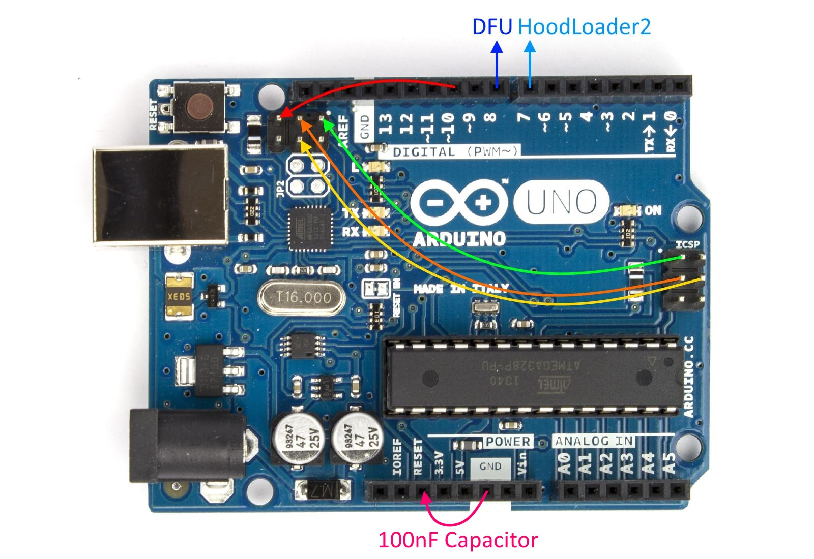
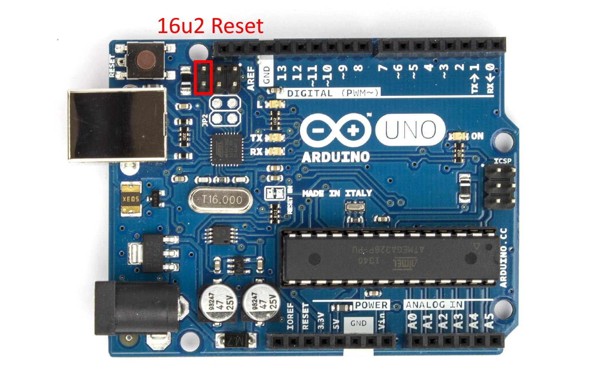

HoodLoader2.0.2
===============


An Arduino Uno/Mega board has two Microcontroller of which one(16u2) is normally used for USB-Serial translation.
But we can also use it as standalone AVR Microcontroller with (or without) USB functions as well.

HoodLoader2 gives you the option to **reprogram the 16u2** of a normal Arduino Uno/Mega R3 with **custom sketches**.
This means you can use the 16u2 as a normal USB AVR like a Leonardo.
You have a full compatible **USB-HID core, CDC Serial** and you can also use the **7 i/o pins of the 16u2**.
The **extended HID devices and USB-Core improvements** of the [HID Project](https://github.com/NicoHood/HID) also apply for the HoodLoader2.

The 16u2 is somehow limited in its functions but still a great addition if you know how to use it. It also compatible with
[FastLED](https://github.com/FastLED/FastLED) and [IRLremote](https://github.com/NicoHood/IRLremote)(with PCINT) for example.

The great thing about this is that you actually have **two fully Arduino compatible Microcontrollers in one Arduino Uno/Mega board**
– the board most of you already own. Your **main MCU (328/2560) is still reprogrammable** if you enter bootloader mode.
**All you need for this is a normal Arduino Uno/Mega R3 and some cables** to install the new HoodLoader2.
Please __read the readme carfully__ to avoid any problems. You will find most of the answers to your questions in the readme.

**See http://nicohood.wordpress.com/ for more tutorials, projects and contact.**

Overview: Features/Limitations
==============================

**Normally every Uno/Mega R3 has a 16u2.** Earlier versions had an 8u2
and some online shops even sell the bigger 32u2 (I've got two of them :D).

**HoodLoader2 functions:**
* CDC Bootloader for the 16u2 (to upload .hex files via avr-dude/Arduino IDE)
* USB-Serial programming of the 328/2560
* No drivers needed for the HoodLoader2 itself
* Self flashing sketch to burn the HoodLoader2 to the 16u2 (modified version from Nick Gammon)

**[HID Project](https://github.com/NicoHood/HID) features (for HoodLoader2):**
* Arduino IDE integration + programming with the 16u2 (USB-Core)
* IDE example sketches for HID devices (Mouse, Keyboard, Gamepad, Media/System Keys)
* IDE example sketch for a working Serial + Keyboard demonstration
* IDE example sketch for PWM demonstration
* IDE example USB-Serial demo (equal to original firmware for baud rate 115200)
* IDE example sketch for 16u2 - 328/2560 communication (HoodLoader1 technique)
* Newer features are listed in the HID Project page itself.

**16u2 features on a normal Uno/Mega R3:**
* 16kb flash (minus 4kb for the HoodLoader2) (8 for a 8u2, 32 for a 32u2)
* 500 bytes Ram 8u2 and 16u2 (1000 bytes Ram for a 32u2)
* 500 bytes EEPROM 8u2 and 16u2 (1000 bytes EEPROM for a 32u2)
* 4 usable USB Endpoints: CDC Serial, HID, MIDI (not all at once)
* 176 bytes DPRAM (ram for USB endpoints, double bank possible)
* 8 and 16 bit timer
* 2 status LEDs (PD4 RX + PD5 TX)
* 7 usable i/o pins with PCINT, SPI and 1PWM (3 pin SPI header + additional 4 pin header)
* HW Serial connected to Serial0 of the 328/2560
* PD7 connected to RESET of the 328/2560
* Not all pins are broken out (SS, INT, etc)
* No I2C (u2 series doesn't have TWI) but Serial (to 328/2560) and SPI (master only)
* No analogue pins
* No USB-Serial bridge at baud 57600 possible, used for CDC self reprogramming

| 8/16/32u2 Flash | Bootloader (4kb)                            | Program (4/12/28kb)    |
|:----------------|:--------------------------------------------|:-----------------------|
| Before          | DFU Bootloader (via Flip)                   | USB-Serial Firmware    |
| After           | HoodLoader2 (CDC Bootloader + USB-Serial)   | Custom Sketch/Firmware |

HoodLoader2 is a __Bootloader__ not a firmware. It replaces the DFU bootloader with a CDC bootloader.
**You wont be able to flash any hex file with [Flip](http://www.atmel.com/tools/flip.aspx) any more.**
But this gives us the option to use avr-dude to flash the 16u2 with custom firmware.

The main advantage is to **flash the 16u2 with the Arduino IDE**.
HoodLoader2 comes with full Arduino compatible USB-Core (see [HID Project](https://github.com/NicoHood/HID))
to create your very own custom programs with the normally unused 16u2 USB chip.

**The USB-Serial bridges allows to reprogram the 328/2560.**
So in bootloader mode your Arduino acts like its used to (except baud 57600).

**See [HID Project](https://github.com/NicoHood/HID) for the Arduino IDE core files/examples.**

HoodLoader2 - Installation
==========================

**Caution: You will overwrite the DFU Bootloader. Read the installing instructions carefully, double check connections and __don't panic__!**
It might be possible that you don't have a 16u2 on your Arduino board, if its a cheap clone.

**You wont be able to flash any hex file with [Flip](http://www.atmel.com/tools/flip.aspx)
via DFU any more** (but via avr-dude instead). You can switch back to DFU later.

**If anything goes wrong while burning the bootloader you can 'brick' your Arduino.**
In this case bricking 'only' means that you cannot use your Arduino's 16u2 USB-Serial bridge any more (and programming via USB too).
Then you need a second working Arduino to burn the firmware again.

To install a bootloader in general you would need an ISP (In system programmer).
If you just want to use your own ISP to burn the hex file, see below.
For those of you who only have a standalone Arduino Uno/Mega R3
we use a modified version of Nick Gammon's [Atmega Board Programmmer](https://github.com/nickgammon/arduino_sketches).
In this case the 328/2560 acts as ISP with a the HoodLoader .hex preloaded in PROGMEM.

### Installation sketch (standalone Arduino Uno/Mega)

This installation method is designed to work with a single Arduino Uno/Mega.
The main MCU (328/2560) gets a sketch with a preloaded firmware and is able to flash the 16u2 via ISP.
Its a special modification of [Nick Gammon's Atmega bootloader programmer](http://www.gammon.com.au/forum/?id=11635)
to ensure high security to not brick your Arduino.

First remove __all__ hardware from your Arduino to ensure nothing is messing up the upload.
All you need to do is to connect the SPI lines correct together like this.
**The 100nF Capacitor is needed to prevent the 328/2560 from not being reset.**
Only plug it in __after__ the sketch is uploaded to the 16u2.



```
100nF Capacitor:
328/2560 RESET - GND (after sketch is uploaded)

Pin connections:
328/2560 - 16u2
MOSI     - MOSI
MISO     - MISO
SCK      - SCK
PIN 10   - 16u2 RESET

Optional Buttons for recovery:
PIN 8    - Force DFU upload
PIN 7    - Force HoodLoader2 upload
```

The installation sketch is located in *tools/Atmega_Board_Programmer/Atmega_Board_Programmer.ino*, open it with your Arduino IDE.

In the first lines of the sketch you can optionally choose to what Arduino you are uploading to otherwise it will automatically detect the right Arduino.
**Upload the installation sketch to your Arduino Uno/Mega, then put in the 100nF capacitor.**
The normal way is to control the uploading via Serial, so open the Serial port monitor at baud 115200.
Follow the instructions (press H + Enter). Then your Arduino should be flashed with the new firmware. Remove all the wires now.
Once you've done this, normally you don't need to do this again, maybe if there is a new HoodLoader2 version.

**Read the [How to use](https://github.com/NicoHood/HoodLoader2#hoodloader2---how-to-use) section**
on how to install and use the HID and USB core and upload new sketches to the 16u2.

##### **Recovery options/how to get back to the original bootloader:**

If anything goes wrong and you can't access the Serial via USB any more you still are able to try different methods to flash the 16u2.
You can use another Arduino and upload the installation sketch there and try the flash again.
Or you can try to access the recovery options of the installation sketch if its still on the 328/2560:

The only way to manually flash the MCU without Serial access is to connect a button to pin 7 (HoodLoader2)
or to pin 8 (DFU + USB-Serial). Therefore make sure all wires are connected properly,
reset the main MCU (328/2560) and short the pin (7 or 8) to ground and wait a few seconds.

### Burning via ISP (advanced)

This is for advanced users who want to burn the bootloader with an external ISP directly.
You can do this with your program if choice (e.g. avr-dude) or use the Arduino IDE and select the correct MCU, board, bootloader and hit "burn bootloader".

```
HoodLoader2 Fuses:
low_fuses=0xFF
high_fuses=0xD9
extended_fuses=0xF4
unlock_bits=0x3F
lock_bits=0x2F


Official DFU + USB-Serial Fuses:
low_fuses=0xEF
high_fuses=0xD9
extended_fuses=0xF4
unlock_bits=0x3F
lock_bits=0xCF
```

### Updating HoodLoader2 to a newer version

Updating to a newer HoodLoader2 version just works like the first install.
Upload the installation sketch and follow the instructions again carefully.
For the HID Project read the updating instructions carefully since they might change from version to version.

**Updating to 2.0.2 just burn the new HoodLoader2 and update to the newest HID Project.**

HoodLoader2 - How to use
==========================


**Short the reset pin once to enter/restart the actual 16u2 program**. Your 16u2 firmware/sketch starts running.
By default the program starts when you plug in the USB-Cable. If no program is presented the bootloader will run.

**Short the reset pin twice to enter bootloader mode manually** to upload code to the 16u2 or the 328/2560.
Then you have full CDC bootloader functions and USB-Serial with auto reset (like on a not modified Arduino except baud 57600).

Once you've uploaded your custom program it is possible that you don't have the CDC Serial any more.
That might happen if you want to use more USB-HID functions instead of a CDC Serial.
To flash the two MCUs (16u2 and 328/2560) you need to enter bootloader mode again by shorting the reset pin twice.

**In bootloader mode the device may enumerate as different USB device than the uploaded sketch.
The HoodLoader2 itself just needs the standard Arduino drivers.**




### How to upload sketches to the 328/2560

Short the 16u2's reset pin twice to enter bootloader mode. You can upload your Arduino sketch like you are used to.
You might need to check the correct Serial port though. To start the 16u2 sketch again short reset once.
To get Serial Debug output from the 328/2560 you also have to enter bootloader mode again.


### How to upload sketches to the 16u2 via IDE

You can now use the 16u2 as normal Arduino USB board like a Leonardo/Micro/Teensy.
Therefore you still need to get some software and install it properly. Arduino IDE 1.5.8 or higher is recommended.

#### CDC Driver installation:

You have to install new drivers (Windows only) since it will conflict with the official due to new USB functions
(it will use a different PID/VID). The driver files is named HoodLoader2.inf.
Also see [this tutorial](http://arduino.cc/en/guide/windows) on how to install the drivers (right click the .inf file and hit install).
[How to install drivers for Windows 8/8.1](https://learn.sparkfun.com/tutorials/disabling-driver-signature-on-windows-8/disabling-signed-driver-enforcement-on-windows-8).

If you want it to be recognized as Uno/Mega edit the board definitions' VID and PID. I don't recommend this to a) know what
Bootloader currently is on your board and b) it seems that with the official signed drivers wont work with unofficial HID modification.

It happened to me that Windows 'lost' the drivers. Go to 'This Pc -> Manage -> Device Manager -> Other devices -> HoodLoader2',
right click and hit 'Update Driver Software... -> Search automatically [...]'.

#### Installing board definitions
To get the 16u2 board definitions for uploading, copy this HoodLoader2 folder into your sketchbook like this: *sketchbook/hardware/HoodLoader2/*

#### Installing HID Project

To actually use the USB functions you need a working USB-Core for the Arduino IDE. At the moment the Arduino IDE does not natively support the u2 series.
Therefore you need to get the new USB-Core with the HID Project. The HID Project also adds new HID Devices to your USB-Core and some more improvements.
(The HID Project can also be used for Arduino Leonardo/Micro and HoodLoader1.)

Go to the [HID Project](https://github.com/NicoHood/HID) page to get the newest Arduino core library for the 16u2.
Follow the installation instructions __carefully__ and **try out the HoodLoader 2 related examples**.

For your interest you can also use this (somehow outdated) [older USB-Core](https://www.mattairtech.com/index.php/development-boards/mt-db-u1.html) with Lufa from Mattairtech.

#### Arduino IDE usage

Using HoodLoader for the first time I recommend to simply upload an 'empty' sketch. If the drivers are installed correctly it will show up as HoodLoader2.
Once you have a sketch with USB-Core and CDC Serial running you can use the normal upload function. Switch to the new Serial port in your IDE and hit upload.
The 16u2 will reset, enter BootLoader mode, reprogram and start the sketch. If it doesn't enter bootloader mode which might happen (also when using no USB-Core)
you have to manually have to enter bootloader mode as described above.

Have a look at the examples in the HID Project and check out the [pinout](https://github.com/NicoHood/HoodLoader2#arduino-unomega-16u2-pinout) below.
**Keep in mind that the Leds have inverted logic. Writing LOW means turn them on.**

#### Deactivating USB-Core

If you don't want to use the USB-Core you can also choose under *Tools/USB Core* "No USB functions" to get rid of the USB stuff
and save the ram for other stuff if you don't need it. You also don't need the HID Project essentially if you don't want to use the USB functions.

**No workaround is no longer needed with version 2.0.1 or newer.**

### How to flash/erase firmwares (.hex files) with avr-dude

If you want to upload a self compiled .hex file from a LUFA project for example like the
[HoodLoader1](https://github.com/NicoHood/HoodLoader) for example
you wont be able to use DFU via Flip any more. But you can use avr-dude instead:

Download avr-dude [here](http://download.savannah.gnu.org/releases/avrdude/) (avrdude-6.1-mingw32.zip for windows).
Open a cmd or bash and try the following code. You can also create a .bat file for easier uploading.
The .bat files are also located in */tools*.

This can also be used to erase the program from your 16u2 if you always want to use it as normal USB-Serial bridge again (always stay in bootloader mode).
And yes, it's correct that **you can have HoodLoader2 and HoodLoader1 running 'at the same time'** since v2 is a real bootloader and v1 'only' a firmware.

```
#select com port, device and .hex file yourself
avrdude.exe -C avrdude.conf -p atmega16u2 -c avr109 -b 57600 -P COM1 -U flash:w:HoodLoader1_8.hex
pause

avrdude.exe -C avrdude.conf -p atmega16u2 -c avr109 -b 57600 -P COM1 -e
pause
```

Arduino Uno/Mega 16u2 Pinout
============================


(c) [pighixxx](http://forum.arduino.cc/index.php/topic,146315.0.html)

**Note: Some pins are not connected on a standard Arduino Uno R3** but still listed so you can use them if you have a custom board.
You also need to solder the additional 4 pin header to access all 7 PB i/o pins. D7 has PWM! (other not connected pins with a timer as well).
The 16u2 pinout is the same for Arduino Uno/Mega.

**Keep in mind that the Leds have inverted logic. Writing LOW means turn them on.**

```
16u2 Pinout
[NC] = Not connected on an Arduino Uno/Mega R3

D0  - [NC] PB0 PCINT0 SS
D1  - PB1 PCINT1 SCLK
D2  - PB2 PCINT2 MOSI
D3  - PB3 PCINT3 MISO
D4  - PB4 PCINT4
D5  - PB5 PCINT5
D6  - PB6 PCINT6
~D7 - PB7 PCINT7 TIMER1C PWM

D8  - [NC] PC7 INT4
D9  - [NC] PC6 PCINT8 TIMER1A
D10 - [NC] PC5 PCINT9 TIMER1B
D11 - [NC] PC4 PCINT10
D12 - [NC] PC2 PCINT11

D13 - [NC] PD0 INT0 TIMER0B
D14 - [NC] PD1 INT1 
D15 - PD2 INT2 USART1 RX
D16 - PD3 INT3 USART1 TX
D17 - PD4 INT4    RXLED
D18 - PD5 PCINT12 TXLED
D19 - [NC] PD6 INT5 
D20 - PD7 INT7 328/2560 RESET
```

Useful Links
============

**A great thx to all people who helped and supported me with this. Most of them are linked below.**

* [HID Project](https://github.com/NicoHood/HID) for the Arduino IDE core files/examples.
* [LUFA from Dean Camera](http://www.fourwalledcubicle.com/LUFA.php)
* [The Original Arduino Sources](https://github.com/arduino/Arduino/tree/master/hardware/arduino/firmwares/atmegaxxu2/arduino-usbserial)
* [Sparkfun 32u4 Bootloader](https://github.com/sparkfun/SF32u4_boards)
* [Nick Gammon's Atmega Board Programmmer](https://github.com/nickgammon/arduino_sketches), [Website](http://www.gammon.com.au/forum/?id=11635).
* [Mattairtechs 16u2 Lufa USB Core](https://www.mattairtech.com/index.php/development-boards/mt-db-u1.html)
* [Paul Brook's Minimus 32u2 Arduino USB Core](https://github.com/pbrook/minimus-arduino)
* [Paul Stoffregen's Teensy Core](https://github.com/PaulStoffregen/cores)
* [Keyboard Led Out report by hartmut_holgraefe](http://forum.arduino.cc/index.php?topic=173583.0)
* [atmega memory use](http://jeelabs.org/2011/05/22/atmega-memory-use/)
* [wiki entry about ram addresses](http://en.wikipedia.org/wiki/Atmel_AVR_instruction_set)
* [How to use AVR-Dude](http://www.ladyada.net/learn/avr/avrdude.html)
* [Installing a bootloader in general](https://learn.sparkfun.com/tutorials/installing-an-arduino-bootloader)
* [IRLremote is also HoodLoader2 compatible](https://github.com/NicoHood/IRLremote)
* [Hackaday post about HoodLoader2](hackaday.com/2014/11/30/using-the-second-microcontroller-on-an-arduino)
* See http://nicohood.wordpress.com/ for more tutorials, projects and contact.

FAQ
===

Questions might be added here. Feel free to contact me for any questions!

See http://nicohood.wordpress.com/ for more tutorials, projects and contact.

Known Bugs
==========

Baud 57600 cannot be used in bootloader mode since its used for CDC programming.

The main MCU will always reset on a 16u2 reprogramming. There is no way to fix this (yet).

The HoodLoader only ensures that you can upload sketches to the MCUs.
If your USB HID device causes any problem please check the HID Project for known bugs/updates.

The Magic BootKey is not stored properly in ram and may cause errors. This is a general Arduino
Software problem, we have to do this to keep compatible. Normally there shouldn't be any noticeable error.
This bug has a workaround in the HID Project so it wont matter any ways. Just want to mention it here.

The USB setting (pid, vid, manufacturer, name) cannot be passed with the new IDE because the u2 Series is not integrated.
These values are defined in the pins_arduino.h

Version History
===============
```
2.0.2 Release (30.11.2014)
* HID Project 2.0 official released:
 * Added Arduino IDE Integration for HoodLoader2
 * See official changelog for more information.
* HoodLoader2.0.2 released (led off fix)

2.0.1 Pre-Release (29.11.2014)
* HoodLoader2.0.1 Release
 * Better, full reset after bootloader execution with watchdog
 * This fixes the "No-USB" workaround with the USB clock
 * Fixed fuse bug
 * Fixed magic key passed from Arduino core (HID Project)
 * Changed some descriptor names, bugfix above freed some space
 * Special case 57600 baud for compatibility with the ATmega328 bootloader TODO resolved (baud reserved for cdc)
 * Reset of 328 when leaving Bootloader mode resolved (not possible to fix)
 * _delay_loop_2() instead delay function resolved (saves 2 bytes, more confusing + inaccurate than useful)
 * CPU_PRESCALE resolved (not needed for bootloader, watchdog will reset it anyways)
 * Re enabled LOCK_BYTE_WRITE_SUPPORT function (due to flash improvements)
 * Increased TX/RX EP_SIZE to 64 bytes
 * Increased Serial->USB Buffer to 128 bytes
* HID Project dev update related to the magic key bugfix
* Updated Atmega board programmer sketch with the new firmware and fuses

2.0.0 Beta-6 Release (05.11.2014)
* Added Arduino-IDE integration workaround for non USB usage

2.0.0 Beta-5 Release (05.11.2014)
* Improved Atmega Bootloader (added stop programming feature)

2.0.0 Beta-4 Release (04.11.2014)
* Improved Atmega Bootloader (Self flashing now works properly)

2.0.0 Beta-3 Release (03.11.2014)
* Improved Atmega Bootloader (DFU now possible)

2.0.0 Beta-2 Release (02.11.2014)
* Added Atmega Bootloader code (no DFU back possible)

2.0.0 Beta-1 Release (02.11.2014)
* Added CDC Bootloader
* Added USB-Serial function
* Made Repository Public

2.0.0 Alpha Release (22.10.2014)
* Added private Github repository with readme
* Added basic functions with dev states
```

Additional Information
======================

### Two Microcontrollers are better than one

**This section describes how the whole thing works together and gives some background information.
For better understanding I recommend to read this.**

As you might know the Arduino Uno/Mega have two AVR Microcontroller.
The Uno has a 328 and the Mega has a 2560. What most people dont know is that
both Arduinos also have a 2nd Microcontroller, the 16u2
(before it was a 8u2 and even earlier it was a simple FTDI USB-Serial bridge).
Some cheap Arduinos might not have a 8u2 or 16u2 because simple FTDI chips might be cheaper
and normally not needed for its normal use.

Here I refer to the 16u2 which is standard for every R3 model of Uno/Mega.
The 16u2 is normally used to program the main MCU 328/2560. Its a USB-Serial Bridge.
But it can be used for many different things because its a standalone AVR
with USB functions like a 32u4 on a Leonardo/Micro board.
For example: [Hiduino](https://github.com/ddiakopoulos/hiduino), 
[Darrens Arduino Uno Keyboard](http://hunt.net.nz/users/darran/weblog/b3029/Arduino_UNO_Keyboard_HID_version_03.html)
[HoodLoader1](https://github.com/NicoHood/HoodLoader) or any other custom firmware.

So what does this tell us? You can use the 16u2 as a normal microcontroller of course.
The problem was that its not accessible to everybody because its a bit hard to understand
how to flash the 16u2, how to compile a program for the 16u2 (especially with [LUFA](http://www.fourwalledcubicle.com/LUFA.php))
and the biggest problem: How to flash the main MCU (328/2560)? Because if you change the 16u2's firmware
you cannot simply flash the Arduinos main MCU.

The [HoodLoader1](https://github.com/NicoHood/HoodLoader)
solved this problem for the first time and its still a good and usable firmware to use USB functions
and upload sketches to the main MCU at the same time like you are used to.
But there were a few challenges with that. The biggest problem was just that it is hard to explain
how that complex stuff works. I think it wasn't clear all the time, also because I had two repositories
([HID Project](https://github.com/NicoHood/HID) and [HoodLoader1](https://github.com/NicoHood/HoodLoader)).

The HID stuff always relied on a Serial communication between 16u2 and 328/2560 which wasn't perfect.
The 16u2 got HID commands with a special [NHP](https://github.com/NicoHood/NicoHoodProtocol) from the main MCU
and filtered every other signal and sent it to the PC Serial (CDC Serial).
Because when the PC USB-HID side was slow it had no chance to wait for the USB keys to flush.
And the main MCU had no chance to get any response back from the 16u2.
Otherwise I had to modify the normal Arduino core libraries very bad to filter out incoming back data
(a 'flushed, next key press' signal) again and it would also blow the sketch size.
Last but not least there were some problems with the multi report descriptor of the [HoodLoader1](https://github.com/NicoHood/HoodLoader)).
To keep things simple for now: Some OS (linux especially with gamepads) had problems with
too many USB-HID devices in a same report (Keyboard, Mouse, 4 gamepads, Media, etc).

This time I want to keep things more clear but still more flexible.
And I also want to add more documentation for those of you who want to learn this USB stuff
and develop more professional things on their own. I know that its hard to understand the USB protocol.
Its a lot of text in the readme, but hopefully some people are glad about that information.

But I am not perfect neither. I learned everything on my own. Learning by doing.
**I started from scratch at the end of Jan 2014 with Arduino/Electronics!**
So you can do that too, I believe in you :)


### Hoodpedia

**Some information that you might find useful. Ask me for more help**

* **CDC-Serial:** A virtual Serial port via USB to the PC
* **USB-HID:** Human Interface Device for Keyboard, Mouse, Gamepad etc to access and controll the PC
* **USB Endpoint:** AVR (16u2 has 1 control endpoint and 4 endpoints for user functions. CDC takes 3 (Control, TX, RX), each HID 1)
* **USB Double Bank:** a doubled DPRAM buffer to fill a bank of an endpoint while the other is read from the PC
* **DPRAM:** Ram for USB communication. The 16u2 has 176 DPRAM which all endpoints share.
(USB Control Endpoint normally uses 8 bytes; CDC Control 8; CDC TX, RX, HID 8-64; double bank *2)
* **RAW-HID:** A two way data pipe with the size of the endpoint to send data from and to the USB device. Also called Generic-HID
* **HID-Report Descriptor:** Describes what devices the USB-HID should have with what functions. Very complicated and can cause errors if its not correct.
See [this tutorial](http://eleccelerator.com/tutorial-about-usb-hid-report-descriptors/) for more information.
* **HID-Multireport:** Each HID device can have multiple devices in one endpoint. This might cause errors with RAW-HID, Gamepads and others.
* **LUFA:** a lightweight USB-API written in C by Dean Camera. Also used by the HoodLoader.
Somehow hard to understand first but very powerful once you've got into it.

### Changes to the Atmega Bootloader Programmer

To upload the HoodLoader2 I used a modification of Nick Gammon's Atmega Bootloader Programmer.
Instructions can be found [here](http://www.gammon.com.au/forum/?id=11635).

One of the change was to add new bootloader files. You can convert your hex file as described with Nick's Lua script.
One thing to add is the address of the 16u2 in the end_addresses array (line 16). The new .lua script is also in the repository now.

You need to download the MUSHclient as described in his instructions.
He provides a simple, [ready to use zip file](http://www.gammon.com.au/downloads/dlmushclient.htm).

### How to compile with a Raspberry Pi (avr-gcc 4.7.2)

This instruction is for compiling the HoodLoader on your own with a Raspberry Pi (Debian).
I cannot tell you how to compile Lufa with any other OS, but Google can.
Believe me: Windows is a struggle to compile.
**On a raspberry you can only use the older avr-gcc 4.7.2 toolchain. Please tell me how to upgrade if you know how.**

For me the easiest thing is to code with my Windows PC only and compile with my Raspberry over ssh.
I recommend creating a Windows share by right clicking your Arduino folder and hit "share".
Then mount this share with your Raspberry like this:
``` bash
$ cd Desktop
$ mkdir Arduino

#Test mounting:
sudo mount -t cifs -o username=yourusername,password=yourpass,nounix,noserverino //YOUR-PC-NAME/Arduino Arduino

#run it automated at startup. If not connected this can cause a long timeout.
sudo nano /etc/fstab
//YOUR-PC-NAME/Arduino /home/pi/Desktop/Arduino cifs username=yourusername,password=yourpass,nounix,noserverino 0 0
```

You need to install the gcc-avr toolchain, avr-libc and compile with:
``` bash
$ sudo apt-get install gcc-avr avr-libc
$ cd Desktop/Arduino/HoodLoader
$ sudo make clean
$ sudo make
```

**HoodLoader2 Beta compiles with 3966(+2 for Mega) bytes with a Raspberry Pi.**

### How to compile with Ubuntu (avr-gcc 4.8.1)

On Ubuntu you can use the newer toolchain which saves ~50 bytes of memory.

You need to install the gcc-avr toolchain, avr-libc and compile with:
``` bash
$ sudo add-apt-repository ppa:pmjdebruijn/gcc-avr-release
$ sudo apt-get update
$ sudo apt-cache search gcc-avr
$ sudo apt-get install gcc-avr avr-libc
$ cd Desktop/Arduino/HoodLoader
$ sudo make clean
$ sudo make
```

[Package information](https://launchpad.net/~pmjdebruijn/+archive/ubuntu/gcc-avr-release)

**HoodLoader2 Beta compiles with about 50 bytes less with this toolchain.**

Licence and Copyright
=====================
If you use this library for any cool project let me know!

```
Copyright (c) 2014 NicoHood
See the readme for credit to other people.

This program is free software: you can redistribute it and/or modify
it under the terms of the GNU General Public License as published by
the Free Software Foundation, either version 3 of the License, or
(at your option) any later version.

This program is distributed in the hope that it will be useful,
but WITHOUT ANY WARRANTY; without even the implied warranty of
MERCHANTABILITY or FITNESS FOR A PARTICULAR PURPOSE.  See the
GNU General Public License for more details.

You should have received a copy of the GNU General Public License
along with this program.  If not, see <http://www.gnu.org/licenses/>.
```
